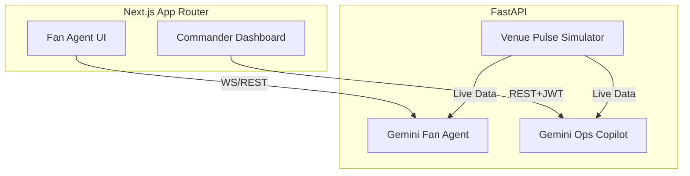

# PulsePoint: The GenAI Operations Copilot

**PulsePoint** is a real-time, dual-agent application built for the FIFA World Cup 2026 at Lumen Field.

## 🎯 Problem Statement & Differentiation
Modern stadium operations during mega-events are chaotic, relying on fragmented radio chatter and static dashboards. **PulsePoint is a staff/volunteer operations copilot first, and a fan assistant second.**

Instead of just answering fan FAQs, PulsePoint ingests a live "Venue Pulse" (simulated crowd density and transit data) to provide actionable, operational intelligence to stadium commanders, while a separate fan-facing agent uses that exact same data to guide attendees step-by-step.

## 🏗 Architecture
The application features a shared **Venue Pulse** websocket layer.



## 🚀 Setup & Local Execution

### Prerequisites
- Node.js 20+
- Python 3.11+
- A valid `GEMINI_API_KEY`

### Using Docker (Recommended)
1. Copy `.env.example` to `.env` and insert your `GEMINI_API_KEY`.
2. Run `docker-compose up --build`.
3. Access the frontend at `http://localhost:3000`.

### Manual Setup
**Backend:**
```bash
cd backend
python -m venv venv
source venv/bin/activate  # On Windows: .\venv\Scripts\Activate
pip install -r requirements.txt
uvicorn main:app --reload --port 8000
```

**Frontend:**
```bash
cd frontend
npm install --legacy-peer-deps
npm run dev
```

## 🗺️ Rubric Mapping

| Criterion | Implementation Location |
|-----------|------------------------|
| **Core Next.js & FastAPI** | `/frontend`, `/backend/main.py` |
| **Generative AI Integration** | `/backend/agent.py`, `/backend/ops_agent.py`, `/backend/sustainability_agent.py` |
| **Operations Copilot** | `/frontend/src/components/CommanderDashboard.tsx`, `IncidentForm.tsx` |
| **Sustainability Module** | `/backend/sustainability.py`, `GreenScoreWidget.tsx` |
| **Security Controls** | `SECURITY.md`, `ci_scan.ps1`, `agent.py (xml tags)` |
| **Automated Tests** | `/backend/tests/`, `/frontend/tests/e2e.spec.ts` |
| **Accessibility (A11y)** | `ACCESSIBILITY.md`, `AccessibilityContext.tsx` |

## ☁️ Deployment
- **Frontend (Vercel)**: Import the `/frontend` directory directly into Vercel. Ensure `NEXT_PUBLIC_API_URL` points to your Cloud Run URL.
- **Backend (Cloud Run)**: A `cloudbuild.yaml` is provided to seamlessly build the backend Dockerfile and push it to Google Cloud Run.
